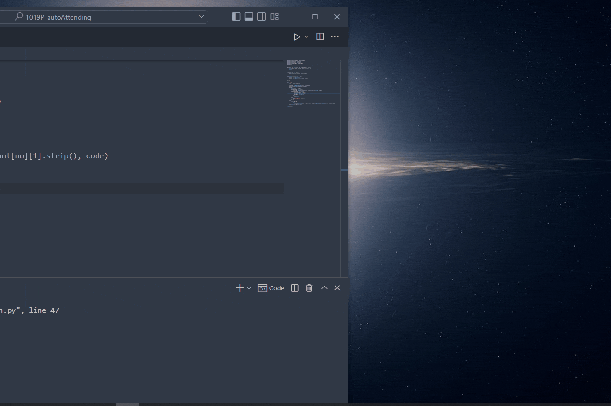
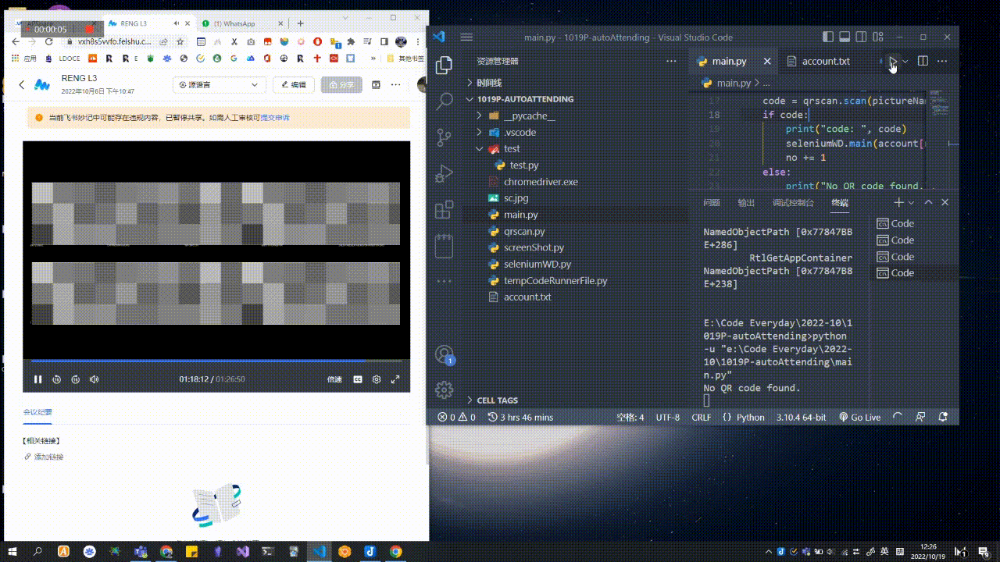

# Automatic-take-attendance

<!-- Improved compatibility of back to top link: See: https://github.com/othneildrew/Best-README-Template/pull/73 -->

<a name="readme-top"></a>

<!-- PROJECT LOGO -->

<br />
<div align="center">
  <a href="https://github.com/yuenci/APU-automatic-take-attendance">
    
  </a>

<h3 align="center">Automatic-take-attendance</h3>

<p align="center">
    A script for APU taking attendance
    <br />
    <a href="https://github.com/yuenci/APU-automatic-take-attendance/blob/master/README.md">EN Doc</a>
    ·
    <a href="https://github.com/yuenci/APU-automatic-take-attendance/blob/master/README_CN.md">中文文档</a>
    <br />
    <br />
    <a href="https://github.com/yuenci/APU-automatic-take-attendance/issues">View Demo</a>
    ·
    <a href="https://github.com/yuenci/APU-automatic-take-attendance/issues">Report Bug</a>
    ·
    <a href="https://github.com/yuenci/APU-automatic-take-attendance/issues">Request Feature</a>
  </p>
</div>

<!-- ABOUT THE PROJECT -->

## About The Project

One day at McDonald's, I had a nice chat with my friends, and then we talked about take attendance. One of my friends said, If only there was something to take attendance automatically, then there was this project.🤣

<h1>JUST FOR FUNNY, DO NOT REALLY UES IT</h1>

<p align="right">(<a href="#readme-top">back to top</a>)</p>

### Built With

* [playsound](https://github.com/TaylorSMarks/playsound)
* [zxing](https://github.com/dlenski/python-zxing)
* [pypiwin32](https://github.com/Googulator/pypiwin32)
* [selenium](https://github.com/seleniumhq/selenium)

<p align="right">(<a href="#readme-top">back to top</a>)</p>

<!-- GETTING STARTED -->

## Getting Started

### Prerequisites

Need install [Python](https://www.python.org/) First.


### Installation

1. Clone the repo

   ```sh
   git clone https://github.com/yuenci/APU-automatic-take-attendance
   ```
2. Enter the following pip command in cmd to install the dependency

   ```bash
   $ pip install -r requirements.txt
   ```
3. Run main.py

<p align="right">(<a href="#readme-top">back to top</a>)</p>

<!-- USAGE EXAMPLES -->

## Usage

1. Bell mode (When QR code is detected, pop-up notificationand ring tone will be played)



2. Auto mode (Need to store your account & pwd in account.txt)



<p align="right">(<a href="#readme-top">back to top</a>)</p>

## Setting

```py
mode = "bell"
# bell: Use music reminder
# auto: Automatically take attendance

belltimes = 1

duration = 2 * 60 * 60
# sencods

log = False
# True: show running log
# False: hide running log

interval = 5
# every X sencods to check QR code
# Note: Too short an interval will affect the performance of your computer.

pictureName = "src/sc.jpg"

screenMode = "window"
# window: screenshot the window
# screen: screenshot the screen

windowName = "Your course name"
# Set the name of the window you want to screenshot


```

<p align="right">(<a href="#readme-top">back to top</a>)</p>

<!-- ROADMAP -->

## Roadmap

- [ ] Automatically push code to wechat
- [ ] Automatically push code to whatsapp

See the [open issues](https://github.com/yuenci/APU-automatic-take-attendance/issues) for a full list of proposed features (and known issues).

<p align="right">(<a href="#readme-top">back to top</a>)</p>

<!-- CONTRIBUTING -->

## Authors

<a href="https://github.com/yuenci" target="_blank" >
  
</a>

<!-- LICENSE -->

## License

Distributed under the MIT License. See [LICENSE](./LICENSE) for more information.

<p align="right">(<a href="#readme-top">back to top</a>)</p>
