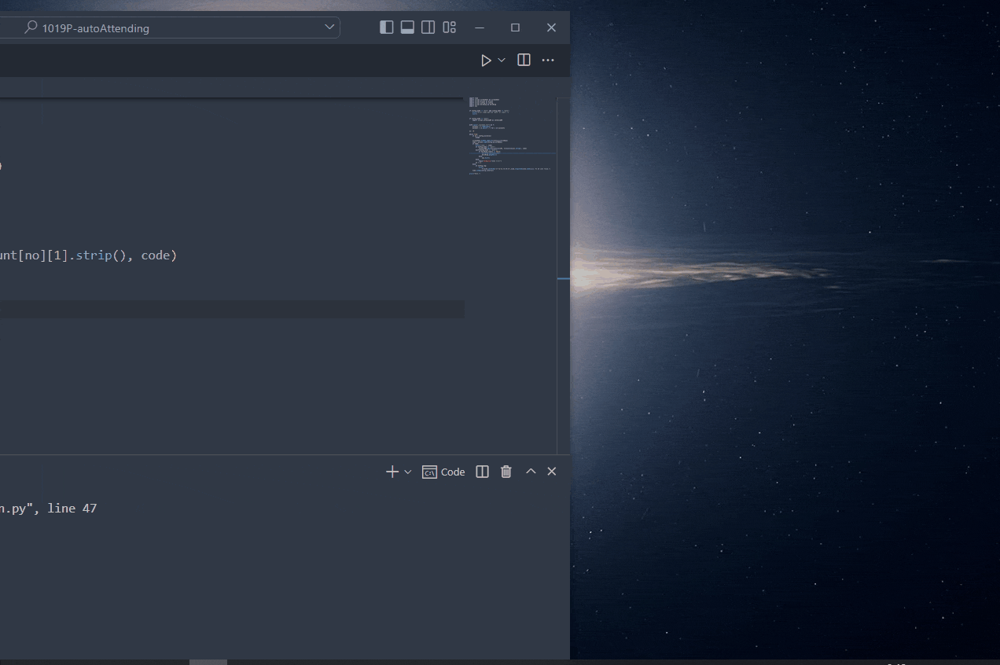

# Automatic-take-attendance

<!-- Improved compatibility of back to top link: See: https://github.com/othneildrew/Best-README-Template/pull/73 -->

<a name="readme-top"></a>

<!-- PROJECT LOGO -->

<br />
<div align="center">
  <a href="https://github.com/yuenci/APU-automatic-take-attendance">
    
  </a>

<h3 align="center">自动签到脚本</h3>

<p align="center">
    一个用于APU签到系统的自动签到脚本
    <br />
    <a href="https://github.com/yuenci/APU-automatic-take-attendance/blob/master/README.md">EN Doc</a>
    ·
    <a href="https://github.com/yuenci/APU-automatic-take-attendance/blob/master/README_CN.md">中文文档</a>
    <br />
    <br />
    <a href="https://github.com/yuenci/APU-automatic-take-attendance/issues">View Demo</a>
    ·
    <a href="https://github.com/yuenci/APU-automatic-take-attendance/issues">Report Bug</a>
    ·
    <a href="https://github.com/yuenci/APU-automatic-take-attendance/issues">Request Feature</a>
  </p>
</div>

<!-- ABOUT THE PROJECT -->

## About The Project

有一天在麦当劳，我和我的朋友聊得很嗨，然后我们谈到了签到的话题。我的一个朋友说，如果有有东西可以自动签到就好了，那么就有这个项目了。🤣

<h1>整活向，别真用！</h1>

<p align="right">(<a href="#readme-top">back to top</a>)</p>

### 构建

* [playsound](https://github.com/TaylorSMarks/playsound)
* [zxing](https://github.com/dlenski/python-zxing)
* [pypiwin32](https://github.com/Googulator/pypiwin32)
* [selenium](https://github.com/seleniumhq/selenium)

<p align="right">(<a href="#readme-top">back to top</a>)</p>

<!-- GETTING STARTED -->

## 开始


### 要求

需要先安装 [Python](https://www.python.org/).

### Installation

1. 克隆仓库到本地，或者直接下载

   ```sh
   git clone https://github.com/yuenci/APU-automatic-take-attendance
   ```
2. 在有Python的环境中，cmd运行下面的命令安装依赖

   ```bash
   $ pip install -r requirements.txt
   ```
3. 运行 main.py 即可进行监控

<p align="right">(<a href="#readme-top">back to top</a>)</p>


<!-- USAGE EXAMPLES -->

## Usage

1. 铃声模式（持续监控team窗口，发现QR code之后，发桌面通知+音乐提醒）



2. 自动模式 (需要把账号密码填写在 account.txt里)


<p align="right">(<a href="#readme-top">back to top</a>)</p>

## 设置
在 script/config.py 文件下

```py
mode = "bell"
# bell: 使用通知 + 音乐提醒
# auto: 自动完成整个签到过程

belltimes = 1

duration = 2 * 60 * 60
# 监控时长（单位：秒）

log = False
# True: 显示运行日志
# False: 不显示运行日志

interval = 5
# 每 X 秒检测一下窗口中是否出现了QR 码
# 注意，如果间隔过小会影响到电脑性能

pictureName = "src/sc.jpg"

screenMode = "screen"
# window: 截取窗口截图
# screen: 截取屏幕截图
# 两种的区别是：screen模式必须保持team在所有窗口前面显示，也就是要在屏幕上看到。window模式下，无需保持team在前台显示，只要不关闭会议的窗口，就可以持续监控到

windowName = "Your course name"
# 设置你当前课程的窗口名称
```

如何获取课程名称


鼠标移动到team的任务栏图标，第二个窗口的名字就是我们所需要的，并不需要全部填进去，只需要起到标识作用即可，一般三四个字符就可。（举例，在此处可设置为： windowName="SDM"）

<p align="right">(<a href="#readme-top">back to top</a>)</p>

<!-- ROADMAP -->

## Roadmap

- [ ] 自动把 code 发送到微信
- [ ] 自动推送code到WhatsApp

在 [这里](https://github.com/yuenci/APU-automatic-take-attendance/issues) 查看更多的功能或者提出你的需求。

<p align="right">(<a href="#readme-top">back to top</a>)</p>

<!-- CONTRIBUTING -->

## Authors

<a href="https://github.com/yuenci" target="_blank" >
  
</a>

<!-- LICENSE -->

## License

采用GPL协议. 查看[LICENSE](./LICENSE) 获取更多信息.

<p align="right">(<a href="#readme-top">back to top</a>)</p>
